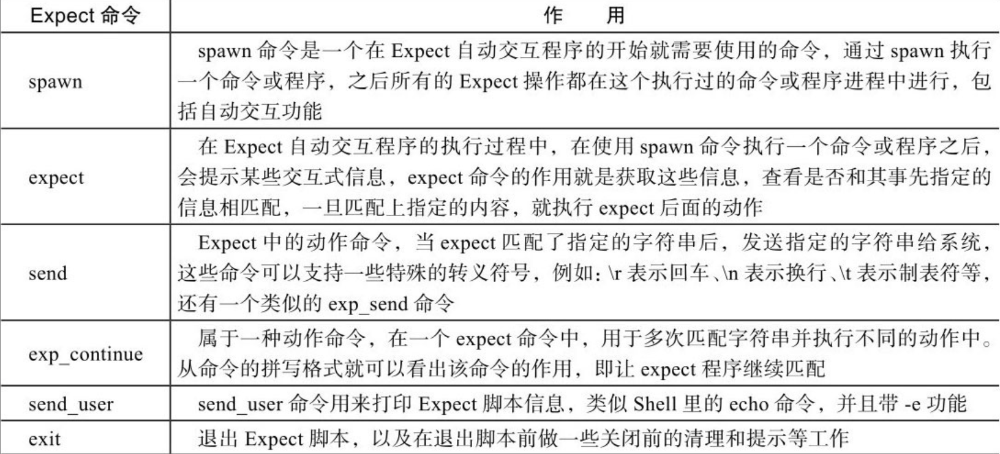

# expect自动化交互

## 什么是expect

Expect是一个用来实现自动交互功能的软件套件。

Expect就是用来自动实现与交互式程序通信的，而无需管理员的手工干预。比如SSH、FTP远程连接等，正常情况下都需要手工与它们进行交互，而使用Expect就可以模拟手工交互的过程，实现自动与远端程序的交互，从而达到自动化运维的目的。

Expect的自动交互工作流程简单说明，依次执行如下操作：

spawn启动指定进程→expect获取期待的关键字→send向指定进程发送指定字符→进程执行完毕，退出结束。

## spawn命令

在Expect自动交互程序执行的过程中，spawn命令是一开始就需要使用的命令，通过spawn执行一个命令或程序，之后所有的Expect操作都会在这个执行过的命令或程序进程中进行，包括自动交互功能，因此如果没有spawn命令，Expect程序将会无法实现自动交互。

spawn命令的语法：

```shell
spawn [选项] [需要自动交互的命令或程序]
spawn ssh root@10.10.10.10 uptime
```

## expect命令

在Expect自动交互程序的执行过程中，当使用spawn命令执行一个命令或程序之后，会提示某些交互式信息，expect命令的作用就是获取spawn命令执行后的信息，看看是否和其事先指定的相匹配，一旦匹配上指定的内容就执行expect后面的动作。

expect命令也有一些选项，相对用得较多的是-re，表示使用正则表达式的方式来匹配。

expect命令的语法：

```shell
expect 表达式 [动作]
```

## send命令

在expect命令匹配指定的字符串后，发送指定的字符串给系统，这些命令可以支持一些特殊转义符号，例如：\r表示回车、\n表示换行、\t表示制表符等

## expect_routine

一般处于expect命令中，属于一种动作命令，一般用在匹配多次字符串的动作中，从命令的拼写就可以看出命令的作用，即让Expect程序继续匹配的意思

如果需要一次匹配多个字符串，那么不同的匹配之间就要加上exp_continue，否则expect将不会自动输入指定的字符串。

## send_user

send_user命令可用来打印Expect脚本信息，类似Shell里的echo命令，而默认的send、exp_send命令都是将字符串输出到Expect程序中去

## exit

exit命令的功能类似于Shell中的exit，即直接退出Expect脚本，除了最基本的退出脚本功能之外，还可以利用这个命令对脚本做一些关闭前的清理和提示等工作

## 总结



```shell
[root@VM-20-11-centos scripts]# cat test_read.sh 
#! /bin/sh
read -p 'plz input your name:' name
read -p 'plz input your password:' password
read -p 'plz input your email:' email

echo  "your name is $name"
echo  "your passwd is $password"
echo  "your email is $email"

[root@VM-20-11-centos scripts]# cat read.exp 
#! /usr/bin/expect

spawn /bin/sh test_read.sh

expect {
	"name" {exp_send "sinlee\n";exp_continue}
        "*password*" {exp_send "123\n"; exp_continue}
        "*email*" {exp_send "sin@163.com.cn\n"}
}
expect eof

[root@VM-20-11-centos scripts]# expect read.exp 
spawn /bin/sh test_read.sh
plz input your name:sinlee
plz input your password:123
plz input your email:sin@163.com.cn
your name is sinlee
your passwd is 123
your email is sin@163.com.cn
[root@VM-20-11-centos scripts]# 
```

## expect变量

### 普通变量

```shell
set 变量名 变量值
```

打印变量的基本语法：

```shell
puts $变量名
```

### 特殊参数变量

在Expect里也有与Shell脚本里的$0、$1、$#等类似的特殊参数变量，用于接收及控制Expect脚本传参。

在Expect中$argv表示参数数组，可以使用[lindex $argv n]接收Expect脚本传参， n从0开始，分别表示第一个[lindex $argv0]参数、第二个[lindex $argv 1]参数、第三个[lindex $argv 2]参数……

Expect接收参数的方式和bash脚本的方式有些区别，bash是通过$0 ... $n这种方式来接收的，而Expect是通过set ＜变量名称＞ [lindex $argv ＜param index＞]来接收的，例如set file[lindex $argv 0]。除了基本的位置参数外，Expect也支持其他的特殊参数，例如：$argc表示传参的个数，$argv0表示脚本的名字。

## expect程序中的if条件语句

if条件语句的基本语法为：

```shell
if {条件表达式}{
   指令
}
或者
if {条件表达式} {
指令
} else {
指令
}
```

if关键字后面要有空格，else关键字前后都要有空格，{条件表达式}大括号里面靠近大括号处可以没有空格，将指令括起来的起始大括号“{”前要有空格

## expect中的关键字

Expect中的特殊关键字用于匹配过程，代表某些特殊的含义或状态，一般只用于Expect命令中而不能在Expect命令外面单独使用。

### eof关键字

eof（end-of-file）关键字用于匹配结束符

### timeout关键字

timeout是Expect中的一个控制时间的关键字变量，它是一个全局性的时间控制开关，可以通过为这个变量赋值来规定整个Expect操作的时间，注意这个变量是服务于Expect全局的，而不是某一条命令，即使命令没有任何错误，到了时间仍然会激活这个变量，此外，到时间后还会激活一个处理及提示信息开关

timeout变量设置为0，表示立即超时，为-1则表示永不超时。
