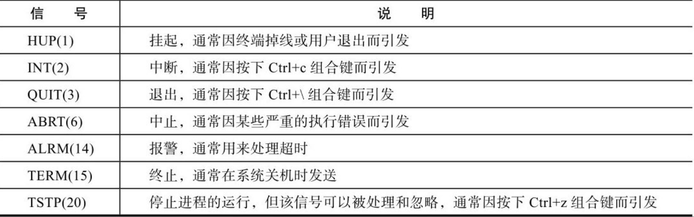

# linux信号及trap命令

Linux的信号是由一个整数构成的异步消息，它可以由某个进程发给其他的进程，也可以在用户按下特定键发生某种异常事件时，由系统发给某个进程。

## 常见信号



## 使用trap控制信号

trap命令用于指定在接收到信号后将要采取的行动，信号的相关说明前面已经提到过。**trap命令的一种常见用途是在脚本程序被中断时完成清理工作，或者屏蔽用户非法使用的某些信号**。在使用信号名时需要省略SIG前缀

trap命令使用语法

```shell
trap command signal
trap '命令; 命令' 信号编号或信号名
```

signal是指接收到的信号，command是指接收到该信号应采取的行动