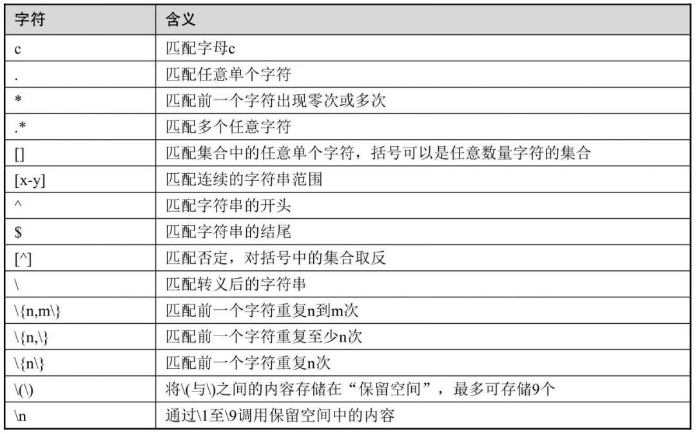
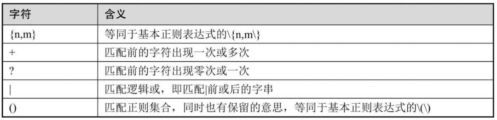
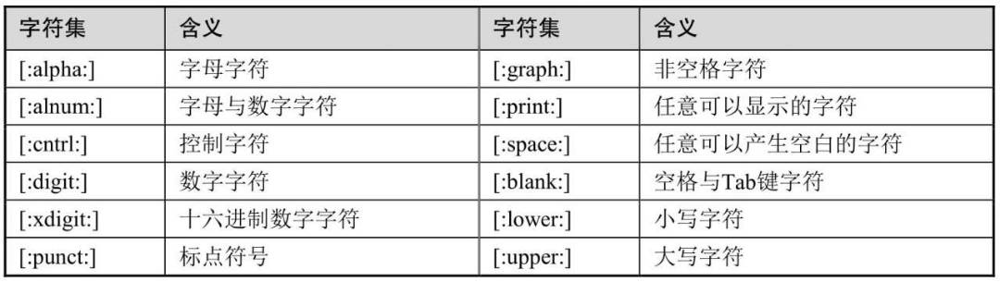

# 脚本书写格式

脚本第一行要求使用shebang(#!)符号指定一个脚本的解释器，如#! /bin/bash

脚本使用#或者<<符号实现单行或多行注释。

```shell
#! /bin/bash

# this is for comment

<< COMMENT
this
is
for
multi-lines
comment
COMMENT

echo "test comment"
```


# 脚本执行方式

1. 脚本本身没有执行权限

```shell
]# bash script_comment.sh
```

2. 脚本具有可执行权限

   ```shell
   [root@iZw bash]# chmod +x script_comment.sh 
   [root@iZw bash]# ./script_comment.sh 
   test comment
   [root@iZw bash]# 
   ```

3. 开启子进程执行的方式

   ```shell
   [root@iZw bash]# ./script_comment.sh 
   [root@iZw bash]# bash script_comment.sh
   ```

4. 不开启子进程的方式

   ```shell
   [root@iZw bash]# source script_comment.sh 
   test comment
   [root@iZw bash]# . script_comment.sh 
   test comment
   ```

# 数据的输入与输出

1. 使用echo

   echo命令支持-e选项，使用该选项可以让echo命令识别\后面的转义符号含义

   ```shell
   [root@iZw bash]# echo -e "hello\tshell"
   hello	shell
   [root@iZw bash]# echo  "hello\tshell"
   hello\tshell
   [root@iZw bash]# echo -e  "hello\fshell"
   hello
        shell
   [root@iZw bash]# echo -e  "hello\nshell"
   hello
   shell
   [root@iZw bash]# echo -e  "hello\bshell"
   hellshell
   [root@iZw bash]# echo -e  "hello\rshell"
   shell
   [root@iZw bash]# echo -e  "hello1\rshell"
   shell1
   ```

2. 使用printf，可以格式化输出数据

   ```shell
   [root@iZw bash]# printf "%d\n" 12
   12
   [root@iZw bash]# printf "%o\n" 12
   14
   [root@iZw bash]# printf "%x\n" 12
   c
   [root@iZw bash]# printf "%f\n" 12
   12.000000
   [root@iZw bash]# printf "%.3f\n" 12
   12.000
   ```

3. 使用read命令读取用户的输入信息

   ```shell
   [root@iZwz9a4t28d8xfs8mpx69iZ bash]# read key
   123
   [root@iZwz9a4t28d8xfs8mpx69iZ bash]# echo $key
   123
   [root@iZwz9a4t28d8xfs8mpx69iZ bash]# read -p "请输入用户名：" user
   请输入用户名：seriouslee
   [root@iZwz9a4t28d8xfs8mpx69iZ bash]# echo $user
   seriouslee
   [root@iZwz9a4t28d8xfs8mpx69iZ bash]# read -s -p "请输入密码：" pass #-s 不显示用户输入的数据
   请输入密码：[root@iZwz9a4t28d8xfs8mpx69iZ bash]# echo $pass
   123456
   ```

   ```shell
   #! /bin/bash
   read -p "请输入用户名：" user
   read -s -p "请输入密码：" passwd
   useradd "$user"
   echo "$passwd" | passwd --stdiin "$user"
   ```

   

# 输入与输出重定向

在Linux系统中输出可以分为标准输出和标准错误输出。标准输出的文件描述符为1，标准错误输出的文件描述符为2。而标准输入的文件描述符则为0。

可以使用> 或者>> 符号将标准输出信息重定向到文件中。> 会覆盖原文件，>> 追加到原文件。

2>会将标准错误信息重定向到文件中， 2>>会将标准错误信息重定向到文件中。

使用&>符号可以同时将标准输出和错误输出都重定向到一个文件，也可以使用&>>追加重定向。

可以使用2＞&1将错误输出重定向到标准正确输出，也可以使用1＞&2将标准正确输出重定向到错误输出。

```shell
[root@iZw bash]# ls ./no_file >out.txt 2>&1
[root@iZw bash]# cat out.txt 
ls: cannot access './no_file': No such file or directory
[root@iZw bash]#
```

还可以将输出重定向到黑洞设备/dev/null,即放弃输出数据。

使用<符号进行输入重定向，可以让程序不再从键盘输出，可以直接读取文件中的数据。

使用<<符号可以将数据内容重定向传递给签名的一个命令，可以作为命令的输入

可以使用＜<-符号重定向输入的方式实现，这样系统会忽略掉所有数据内容及分隔符（EOF）前面的Tab键。使用这种方式仅可以忽略Tab键

```shell
#! /bin/bash
cat > ./redirect.txt << EOF
	redirect data to program
EOF

cat >> ./redirect.txt <<- EOF
	redirect data to program
EOF
```

```shell
[root@iZw bash]# bash redirect.sh 
[root@iZw bash]# cat redirect.txt 
	redirect data to program
redirect data to program
```

# 引号的使用

1. 双引号

   会将引号中的所有内容当作一个整体看待

2. 单引号

   单引号也可以引用一个整体，单引号还有其他功能，可以屏蔽特殊符号，将特殊符号的特殊含义屏蔽，转化为字符表面的名义

   ```shell
   [root@iZwz9a4t28d8xfs8mpx69iZ bash]# a=12
   [root@iZwz9a4t28d8xfs8mpx69iZ bash]# echo "$a"
   12
   [root@iZwz9a4t28d8xfs8mpx69iZ bash]# echo '$a'
   $a
   ```

   还可以使用\符号实现屏蔽转义的功能

   ```shell
   [root@iZwz9a4t28d8xfs8mpx69iZ bash]# echo \$a
   $a
   ```

3. 反引号

   反引号(``)是一个命令替换符号，可以使用命令输出结果替代命令

   $()组合符号，也支持命令替换，而且支持嵌套功能

   ```shell
   [root@ shell]# touch `date +%Y%m%d`.txt
   [root@ shell]# touch $(date +%Y-%m-%d).txt
   [root@ shell]# ll
   总用量 8
   -rw-r--r-- 1 root root    0 11月 28 21:25 2021-11-28.txt
   -rw-r--r-- 1 root root    0 11月 28 21:25 20211128.txt
   ```

   

# 变量

变量名可以使用字母、数字和下划线组合，不可以使用数字开头。

需要读取变量值时，需要在变量名前添加一个美元符号“$”；而当变量名与其他非变量名的字符混在一起时，需要使用{}分隔

如果需要取消变量的定义，则可以使用unset命令删除变量。

系统预设变量

```shell
#! /bin/bash
echo "\$USER返回当前用户：$USER,\$UID返回当前用户UID：$UID"
echo "\$HOME返回当前家目录：$HOME"
echo "\$PWD返回当前目录：$PWD"
echo "\$\$返回当前进程号：$$"
echo "\$0返回当前脚本名称：$0"
echo "\$1返回脚本第一个参数：$1"
echo "\$*返回当前脚本所有参数(作为一个字符串）：$*"
echo "\$@返回当前脚本所有参数(作为多个字符串）：$@"

echo "\$?返回前一个命令的返回状态码：$?"
```

```shell
[root@iZwz9a4t28d8xfs8mpx69iZ bash]# bash sys_var.sh A B C D
$USER返回当前用户：root,$UID返回当前用户UID：0
$HOME返回当前家目录：/root
$PWD返回当前目录：/root/git_proj/shell/bash
$$返回当前进程号：77874
$0返回当前脚本名称：sys_var.sh
$1返回脚本第一个参数：A
$*返回当前脚本所有参数(作为一个字符串）：A B C D
$@返回当前脚本所有参数(作为多个字符串）：A B C D
$?返回前一个命令的返回状态码：0
```

# 正则表达式

1. 基本正则表达式

   

   c:匹配字母c

   .:匹配任意字符串

   *:匹配前一个字符出现零次或多次

   .*:匹配多个任意字符

   []:匹配计划中的任意单个字符

   [x-y] : 匹配联系的字符串范围

   ^ ： 匹配字符串的开头

   \ ：匹配转义后的字符串

   $ ：匹配字符串的结尾

   [^] ：匹配否定，对括号中的集合取反

   \\{n,m\\} ：匹配前一个字符重复n到m次

   \\{n,\\} ：至少n次

   \\{n\\} ： 只匹配n次

2. 扩展正则表达式

   

   {n,m} 

   +: 匹配前一个字符出现一次或多次

   ?：匹配零次或一次

   |：匹配逻辑或，匹配|前或者后的字符

3. POSIX正则表达式

   

   [:alpha:] 字母字符

   [:alnum:] 字母与数字

   [:antrl:] 控制字符

   [:digit:] 数字

   [:punct:] 十六进制数字

   [:graph:] 非空格字符

   [:print:] 任意可以显示的字符

   [:space:] 任意可以产生空白的字符

   [:blank:] 空格与tab

   [:lower:] 小写字符

   [:upper:] 大写字符

4. GNU规范

   \b（边界字符，匹配单词的开始或结尾）, 

   \B（与\b为反义词，\Bthe\B不会匹配单词the，仅会匹配the在中间的单词，如atheist）, 

   \w（等同于[_[:alnum:]]）, 

   _\W（等同于[^_[:alnum:]]）。

   另外有部分软件支持使用\d表示任意数字，

   \D表示任意非数字。

   \s表示任意空白字符（空格、制表符等）,

    \S表示任意非空白字符。

# 算术运算

Shell支持多种算术运算，可以使用$（（表达式））、$[表达式]、let表达式进行整数的算术运算，注意这些命令无法执行小数运算；使用bc命令可以进行小数运算

```shell
[root@iZwz9a4t28d8xfs8mpx69iZ bash]# echo $((4+2))
6
[root@iZwz9a4t28d8xfs8mpx69iZ bash]# echo $(4+2)
-bash: 4+2: command not found

[root@iZwz9a4t28d8xfs8mpx69iZ bash]# echo $[4+2]
6
[root@iZwz9a4t28d8xfs8mpx69iZ bash]# x=5
[root@iZwz9a4t28d8xfs8mpx69iZ bash]# let x++
[root@iZwz9a4t28d8xfs8mpx69iZ bash]# echo $x
6
[root@iZwz9a4t28d8xfs8mpx69iZ bash]# let a=1+2*3;echo $a
7
[root@iZwz9a4t28d8xfs8mpx69iZ bash]# x=$(echo "1+2*3"|bc)
[root@iZwz9a4t28d8xfs8mpx69iZ bash]# echo $x
7
```

