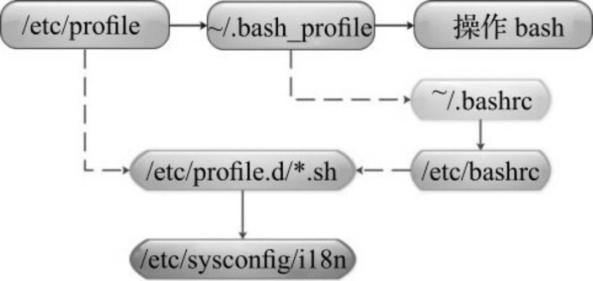
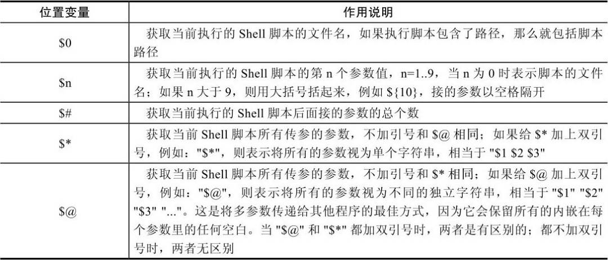
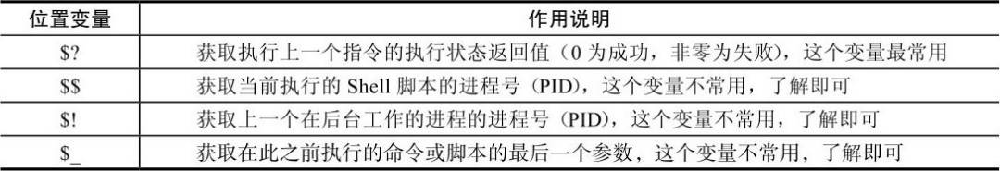
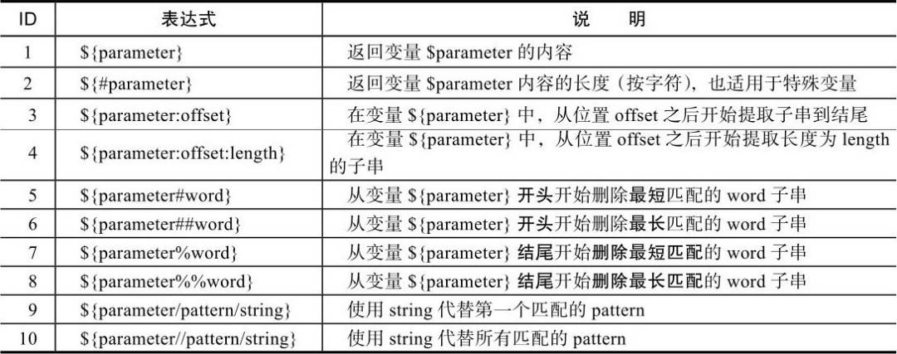
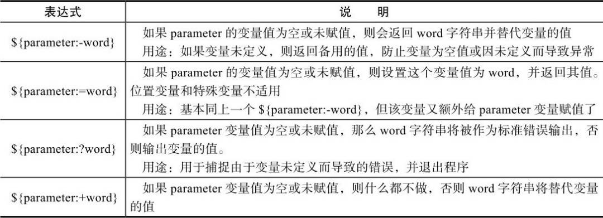
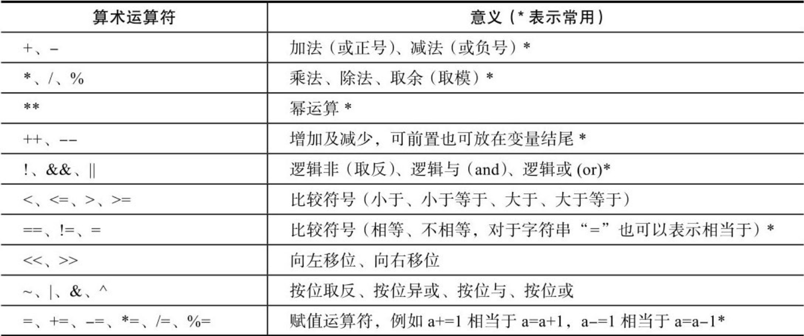
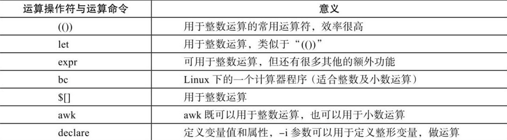

# shell变量

变量可分为两类：环境变量（全局变量）和普通变量（局部变量）

# 环境变量

环境变量一般是指用export内置命令导出的变量，用于定义Shell的运行环境，保证Shell命令的正确执行

如果希望永久保存环境变量，可在用户家目录下的．bash_profile或．bashrc（非用户登录模式特有，例如远程SSH）文件中，或者全局配置/etc/bashrc（非用户登录模式特有，例如远程SSH）或/etc/profile文件中定义

## 设置环境变量

使用export或declare命令

```shell
[root@iZw var]# export VAR=123
[root@iZw var]# echo $VAR
123
[root@iZw var]# declare -x VAR1=345
[root@iZw var]# echo $VAR1
345
```

设置用户的环境变量

对于用户的环境变量设置，比较常见的是用户家目录下的.bashrc和.bash_profile。

全局 环境变量配置

/etc/profile

/etc/bashrc

/etc/profile.d/

## 显示与取消环境变量

1. 使用echo或printf命令打印环境变量

2. 使用unset消除本地变量和环境变量

   ```shell
   [root@iZw var]# unset VAR1
   [root@iZw var]# echo $VAR1
   
   
   ```

   

## 环境变量初始化与队友文件生效顺序

bash检查的环境变量文件的情况取决于系统运行Shell的方式。系统运行Shell的方式一般有3种：
1） 通过系统用户登录后默认运行的Shell。
2） 非登录交互式运行Shell。
3） 执行脚本运行非交互式Shell。

用户登录linux是，shell会作为登录shell启动




用户登录系统后首先会加载**/etc/profile**全局环境变量文件，这是Linux系统上默认的Shell主环境变量文件。系统上每个用户登录都会加载这个文件。
当加载完/etc/profile文件后，才会执行**/etc/profile.d**目录下的脚本文件，这个目录下的脚本文件有很多，例如：系统的字符集设置（**/etc/sysconfig/i18n**）等，在后文开发跳板机案例里，我们也把脚本的起始加载放到这个目录下，以便用户登录后即刻运行脚本。
之后开始运行**$HOME/.bash_profile**（用户环境变量文件），在这个文件中，又会去找**$HOME/.bashrc**（用户环境变量文件），如果有，则执行，如果没有，则不执行。在$HOME/.bashrc文件中又会去找**/etc/bashrc**（全局环境变量文件），如果有，则执行，如果没有，则不执行。

非登录shell

如果用户的Shell不是登录时启动的（比如手动敲下bash时启动或者其他不需要输入密码的登录及远程SSH连接情况 ），那么这种非登录Shell只会加载**$HOME/.bashrc** （用户环境变量文件），并会去找**/etc/bashrc**（全局环境变量文件）。因此如果希望在非登录Shell下也可读到设置的环境变量等内容，就需要将变量设定等写入$HOME/.bashrc或者/etc/bashrc，而不是$HOME/.bash_profile或/etc/profile。

# 普通变量

本地变量在用户当前Shell生存期的脚本中使用。


# 位置参数变量



# 进程中的特殊状态变量



# 变量子串



# 扩展变量



# 变量的数值计算

## 算术运算

常见算术运算符号



算术运算命令

