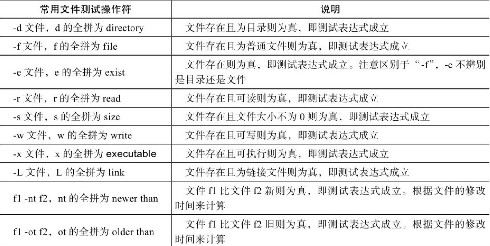
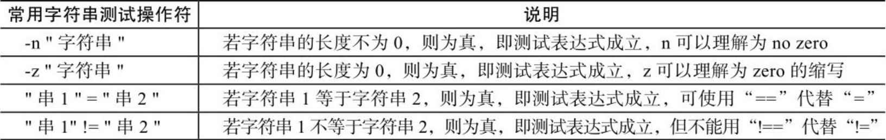
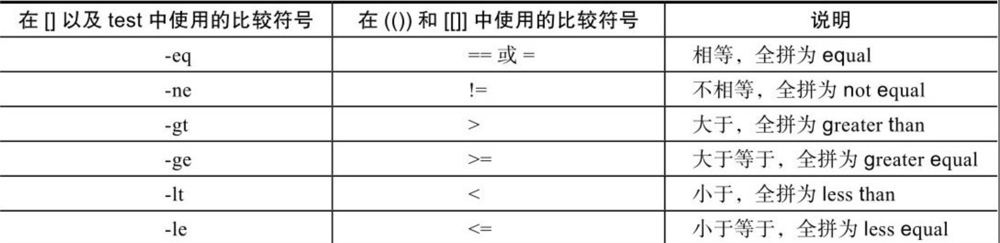
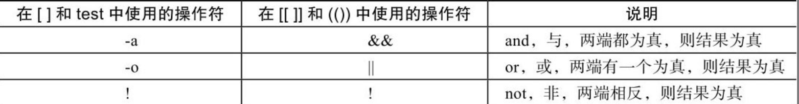
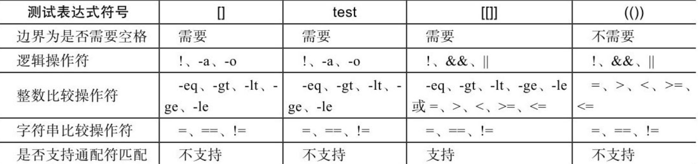

# 测试语句

## 条件测试方法

常用条件测试语法


1. test 测试表达式

2. [ 测试表达式 ] 推荐使用这种方式

3. [[ 测试表达式 ]]

   测试表达式可以使用通配符进行模式匹配

   &&、||、＞、＜等操作符可以应用于[[]]中，但不能应用于[]中，在[]中一般用-a、-o、-gt（用于整数）、-lt（用于整数）

4. ((测试表达式))

## 文件测试表达式



```shell
-d 判断是否是目录
-f 判断是否是文件
-e 判断文件是否存在
-r 判断文件存在且文件可读
-s 判断文件大小是否大于0
-w 判断文件是否可写
-x 判断文件是否可执行
-L 判断文件是否为链接文件
```

用[]测试变量时，如果被测试的变量不加双引号，那么测试结果可能会是不正确的

## 字符串测试表达式



```shell
-n 判断字符串长度是否不为0
-z 判断字符串长度是否为0
```

字符串比较时若等号两端没有空格，则会导致判断出现逻辑错误，即使语法没问题，但是结果依然可能不对。

字符串不加双引号，可能会导致判断上出现逻辑错误，即使语法没问题，但是结果依然可能不对。

## 整数二元操作符



## 逻辑操作符



## 测试表达式test、[]、[[]]、(())的区别总结

